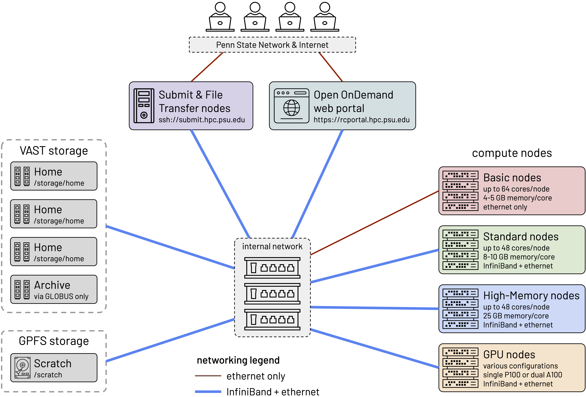

# System overview

Compute clusters like Roar serve many purposes:

- **number crunching**, much bigger and faster than a laptop
- **batch compute jobs**, submitted and performed later
- **interactive computing**, on the equivalent of a powerful workstation
- **large-scale storage** and access of data files

## Architecture

Roar consists of different parts, connected together by networks:

- **users** of the cluster, who connect to either
- **the Portal**, for interactive computing, or
- **submit nodes**, to prepare and submit jobs;
- **file storage** for user files, plus
- **scratch storage** for temporary files; and 
- **compute nodes**, of several different types.

## Accounts

To log on to Roar, you need a [login account](connecting.md/#login-accounts).
To work on Roar, you can use the open queue at no cost,
which gives you access to the Portal, 
and to batch jobs on vintage hardware.

But to use any of the newer, more powerful hardware, 
you need either a paid [credit account](../accounts/paying-for-compute.md), 
or a paid [allocation](../accounts/paying-for-compute.md).
With credit accounts, you pay only only the compute resources you use,
and can use any type of nodes you need.
However, if you require prompt access to specific hardware,
you can opt for an allocation ---
in which you reserve specific hardware,
and pay whether or not you use the compute time.

## Two ways to access 

Roar can be accessed in two ways:  via the web-based Portal  
<https://portal.hpc.psu.edu/pun/sys/dashboard>  
and by "secure shell" ([`ssh`][ssh]) 
from a terminal application.
[ssh]: https://linux.die.net/man/1/ssh

The Portal (which runs [Open OnDemand](https://openondemand.org))
is designed mainly for interactive work.
It provides:

- a Windows-like desktop environment;
- a web-based file browser, to upload and download files;
- graphical, number-crunching programs, 
such as ANSYS, COMSOL, MATLAB, and RStudio.

The Portal is easy to use, 
because its preloaded programs can be launched and used without knowing Unix.
Its Windows-like desktop provides a familiar "feel"
for users accustomed to laptops (especially Linux laptops).
From its Terminal application,
users have access to the full capabilities of Roar,
needed to prepare and submit jobs.

Roar can also be accessed via SSH (Secure SHell),
from a terminal application on a laptop.
For more information about Portal and SSH access,
see [Connecting](connecting.md).

