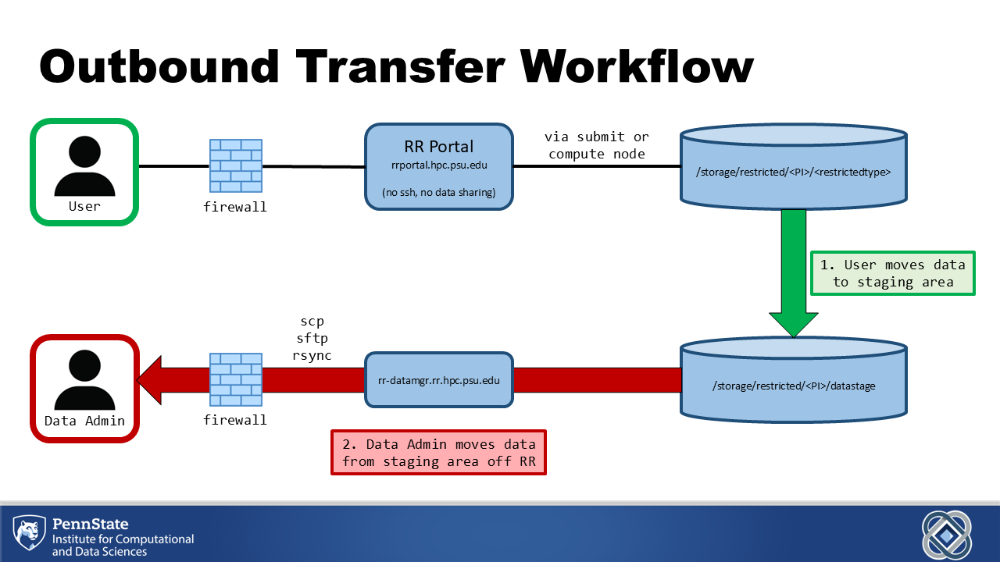
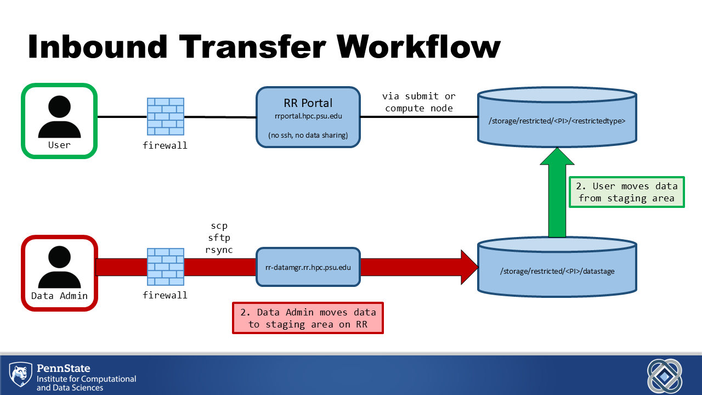

# Data transfer 

To limit the risk of data leaks
and comply with restricted data storage standards,
ICDS has implemented a Secure Data Transfer Management Model:
transfer of data to and from RR 
can only be performed via a data manager node,
to which access is limited.

RR users can move data between their group storage 
and the group's staging area on the data manager node;
but only approved data administrators can move data
between the staging area and the outside world
(see diagrams below).

PIs can request approval to perform such data transfers,
or nominate data administrators from their group.
To request data administrator access,
a user must email <icds@psu.edu>, copying the PI sponsor.
The sponsor must approve the user's request,
after which the user must submit the 
[Data Transfer System Access Request Form][request_form]
to be granted access to the data manager node.
[request_form]: https://pennstate.service-now.com/sp?id=sc_cat_item&sys_id=1bd490a71bfa0e10bd31ed74bd4bcb77 

While conducting transfers, data administrators are responsible 
for adhering to the data management standards and guidelines.
PIs and their data administrators must attest annually 
that they still need access to the data manager node.
