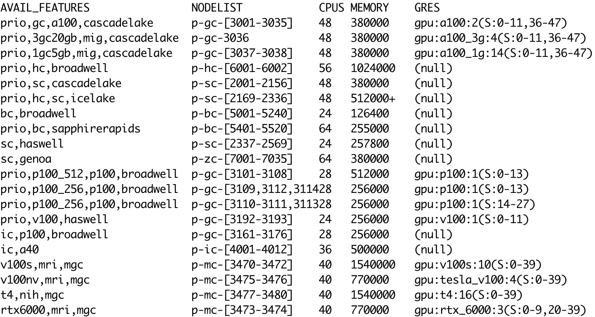

# Hardware requests 

Users with paid credit accounts and allocations can request GPU nodes,
and fine-tune their hardware requests with `constraint` directives.

## GPUs

GPUs are only available to paid credit accounts,
or allocations that include GPU nodes.  
For a batch job paid by a credit account, to request a single GPU:

```
--partition=standard
--gres=gpu:1
```

To request n GPUs, replace 1 above by n.  
To request a specific model of GPU, use `--gres=gpu:a100:1`.

For an interactive job paid by a credit account, use `salloc`:
```
salloc -A <account> -p standard --gres=gpu:a100:1 ...
```

If the job is paid by an allocation, use `-p sla-prio` instead of `-p standard`.

For information on available GPU nodes, see [Compute Hardware][hardware].
[hardware]: ../getting-started/compute-hardware.md

!!! warning "Make sure your application is GPU-enabled."
    If your application does not use GPUs,   
    requesting GPUs will do nothing except deplete your accounts.  

## Hardware info

Even within different hardware partitions, not all nodes on Roar are identical.
Often, software compiled for one type of CPU or GPU will not run on another, older type.

To find out about hardware on different nodes, there are several options.

If you are logged onto a compute node with an [interactive job][salloc], 
the command `lscpu` displays information about the CPUs;
`nvidia-smi` displays information about the GPUs (if present).
[salloc]: interactive-jobs.md

The SLURM command [`sinfo`][sinfo] displays information about *all* Roar nodes.
Its output is more easily read with some formatting options,
[sinfo]: https://slurm.schedmd.com/sinfo.html

```
sinfo --Format=features:30,nodelist:20,cpus:5,memory:10,gres:30
```

On Roar, `sinfo` output would look like:



Evidently, node attributes serve to identify nodes with a given

- CPU type (broadwell, haswell, ...)
- GPU type (a100, g100)
- partition (bc, sc, hc, gc, ic,...)
- specific hardware combinations (p100_256, 3gc20gb, ...)


## Constraints

Users with paid credit accounts and allocations can fine-tune their hardware requests 
with `constraint` directives.  In a batch script, constraints take the form:

```
#SBATCH --constraint=<feature>
```

where `<feature>` is one of the features listed by `sinfo` 
(or multiple features, separated by commas).
For example, to request `cascadelake` hardware, use `--constraint=cascadelake`.

For an [interactive job][salloc], constraints are given
with a `-C` option to `salloc`:

```
salloc -N 1 -n 4 -A <alloc> -C <feature> -t 1:00:00
```

!!!warning "Resource requests must match the allocation."
	For paid allocations, constraint directives
	must be consistent with the terms of the allocation.
	For credit accounts, any hardware can be requested.

